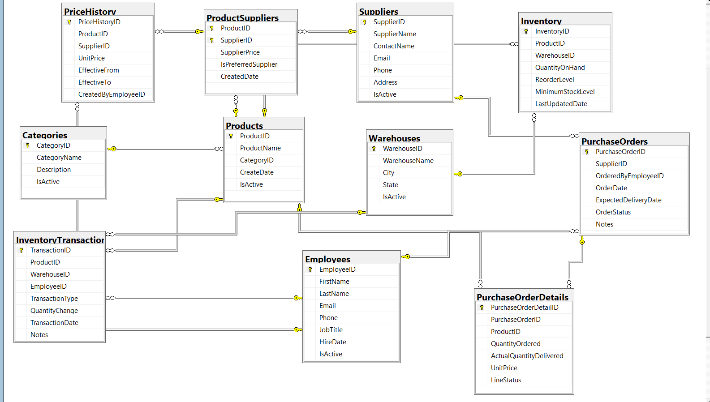

# Inventory Management System

**Company:** Northwind Retail Group — Fictional Company  
**Role:** SQL Server Database Administrator  
**Project Status:** Core SQL Server Implementation Completed

---

## Project Overview

This project simulates a real-world SQL Server inventory management system for a fictional retail organization.

The database was designed to manage products, suppliers, warehouses, employees, inventory levels, purchase orders, pricing history, and inventory transactions.

The project was built as a hands-on SQL Server DBA portfolio project and demonstrates the full database lifecycle—from relational database design and T-SQL development to performance tuning, backup and recovery, integrity checking, and operational monitoring.

---

## Business Problem

Northwind Retail Group requires a centralized database system to:

- Track inventory across multiple warehouses
- Manage products and suppliers
- Record inventory movements and adjustments
- Maintain product pricing history
- Manage purchase orders
- Identify low-stock products
- Provide reusable reporting queries
- Maintain database integrity and recoverability
- Monitor database health and performance

---

## Technologies Used

- Microsoft SQL Server
- SQL Server Management Studio (SSMS)
- T-SQL
- Visual Studio Code
- Git
- GitHub
- GitHub Desktop

---

## Database Objects

### Core Tables

- Employees
- Categories
- Suppliers
- Warehouses
- Products
- ProductSuppliers
- Inventory
- PriceHistory
- InventoryTransactions
- PurchaseOrders
- PurchaseOrderDetails

### Reporting Views

Views were created to support:

- Current inventory reporting
- Low-stock monitoring
- Purchase history
- Product and supplier pricing

### Stored Procedures

Stored procedures were developed for:

- Product searching
- Low-stock reporting
- Warehouse inventory reporting
- Receiving inventory
- Inventory adjustments
- Product price history

Transactions, validation, `TRY...CATCH`, and `THROW` were implemented where appropriate to protect data integrity and centralize business logic.

---

## Business Rules and Data Integrity

The database implements:

- Primary and foreign keys
- Identity columns
- UNIQUE constraints
- CHECK constraints
- DEFAULT constraints
- Many-to-many product/supplier relationships
- Inventory quantity validation
- Unique product/warehouse inventory records
- Transaction-based inventory updates
- Inventory transaction auditing

---

# Project Implementation

## Phase 1 — Database Design

Designed the relational database structure, including tables, relationships, data types, primary keys, foreign keys, and business constraints.

## Phase 2 — Data Population

Populated the database with realistic test data for employees, categories, suppliers, warehouses, products, inventory, pricing, purchasing, and inventory transactions.

## Phase 3 — Reporting Views

Created reusable views to simplify inventory, low-stock, purchasing, and supplier-pricing reporting.

## Phase 4 — Stored Procedures

Developed reusable stored procedures with parameters, transactions, validation, and error handling to centralize database business logic.

## Phase 5 — Performance & Optimization

Performed hands-on query performance analysis using:

- Actual Execution Plans
- `STATISTICS IO`
- `STATISTICS TIME`
- Clustered Index Scans
- Nonclustered Index Seeks
- Key Lookup analysis
- Covering indexes
- SARGable predicates
- Composite index design
- SQL Server statistics
- Index fragmentation analysis

## Phase 6 — DBA Administration

Performed core database administration activities including:

- Full database backup
- Backup checksums
- `RESTORE VERIFYONLY`
- `DBCC CHECKDB`
- `RESTORE FILELISTONLY`
- Test database restore
- `WITH MOVE`
- Recovery validation
- Database health monitoring
- Database file monitoring
- Backup history monitoring
- Index fragmentation analysis

---

# Performance and Optimization Case Studies

## Product Search Optimization

A product search initially resulted in a **Clustered Index Scan**.

After increasing the test dataset to more than 50,000 product records, SQL Server selected a **Nonclustered Index Seek with a Key Lookup**.

The index was then redesigned as a covering index, allowing SQL Server to satisfy the query without the additional Key Lookup.

### Performance progression

```text
Clustered Index Scan
        ↓
Nonclustered Index Seek + Key Lookup
        ↓
Covering Index Seek
```

This exercise demonstrated how table size, index design, statistics, and selected columns influence SQL Server execution plans.

---

## SARGable Query Optimization

A PurchaseOrders query originally used:

```sql
WHERE YEAR(OrderDate) = 2026
```

The execution plan showed a **Nonclustered Index Scan**.

The predicate was rewritten as:

```sql
WHERE OrderDate >= '20260101'
  AND OrderDate < '20270101'
```

The existing composite index was also evaluated and found to have `SupplierID` as its leading key, which was not ideal for a query filtering only by `OrderDate`.

A new index with `OrderDate` as the leading key was implemented.

The final execution plan produced a:

**Nonclustered Index Seek**

This demonstrated that query optimization involves both writing efficient predicates and designing indexes around actual access patterns.

---

# Backup & Recovery Case Study

A full backup of the `InventoryManagement` database was created using `CHECKSUM`.

The backup was then:

1. Verified using `RESTORE VERIFYONLY`
2. Checked alongside database integrity testing using `DBCC CHECKDB`
3. Inspected using `RESTORE FILELISTONLY`
4. Restored as a separate test database using `WITH MOVE`
5. Brought online and queried to validate successful recovery

This demonstrated that a backup strategy should include verification and actual restore testing rather than relying only on successful backup completion.

---

# Database Health & Maintenance

Reusable DBA monitoring queries were created to review:

- Database online/offline status
- Recovery models
- Compatibility levels
- MDF and LDF file locations
- Database file sizes
- Full backup history
- Differential backup history
- Transaction log backup history
- Index fragmentation and page counts

Index fragmentation was evaluated using `sys.dm_db_index_physical_stats`.

The largest tested indexes showed low fragmentation, so no unnecessary REORGANIZE or REBUILD operation was performed.

---

## Repository Structure

```text
Inventory-Management-System/
│
├── Data-Model-Diagram/
├── Screenshots/
│
├── SQL/
│   ├── Phase-1-Database-Design/
│   ├── Phase-2-Data-Population/
│   ├── Phase-3-Reporting-Views/
│   ├── Phase-4-Stored-Procedures/
│   ├── Phase-5-Performance-and-Optimization/
│   └── Phase-6-DBA-Administration/
│
├── Lab-Notes.md
└── README.md
```

---

## Skills Demonstrated

- SQL Server Database Administration
- Relational Database Design
- T-SQL
- Data Integrity
- Stored Procedures
- Transactions
- Error Handling
- Views
- Index Design
- Execution Plan Analysis
- Query Performance Tuning
- SARGability
- SQL Server Statistics
- Backup and Recovery
- Database Integrity Checks
- Database Monitoring
- Index Fragmentation Analysis
- Troubleshooting and Documentation

---

## Key Takeaways

This project strengthened my ability to approach SQL Server from both a database development and administration perspective.

Rather than only creating database objects, I practiced analyzing execution plans, troubleshooting query performance, designing indexes based on query patterns, validating database backups, performing test restores, checking database integrity, and making maintenance decisions based on observed database conditions.

The project also reinforced the importance of documenting technical decisions and understanding why SQL Server behaves a certain way instead of simply executing commands.

---

## Future Enhancements

Potential future enhancements include:

- SQL Server Agent maintenance jobs
- Database security and role-based access control
- Transaction log backup strategy
- Differential backups
- Point-in-time recovery testing
- Power BI reporting
- Power Apps integration
- Azure SQL Database migration/testing


## Database Diagram

The diagram below shows the relational structure of the Inventory Management System, including primary keys, foreign keys, and relationships between the core database tables.

